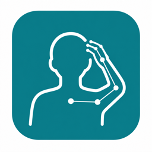

<p align="center">
  
</p>

# BodyPoseTracker

BodyPoseTracker is a small native macOS menu-bar app that watches for your hand
near your head and gives you a gentle warning when the gesture lingers. It was
built as a local-first habit interruption tool for moments like hair touching or
hair picking while working at a desk.

The app uses the FaceTime camera, Apple Vision face detection, and Apple Vision
hand landmarks. It runs on-device, does not upload video, and keeps the same
detection path for the background app and the debug preview.

## Features

- Runs quietly from the macOS menu bar.
- Detects face position and one nearby hand using Apple Vision.
- Warns only after the hand stays near the head for a short delay.
- Plays a bundled alarm sound and flashes a red menu-bar bubble while active.
- Includes an AppKit debug preview that shows the live camera feed, hand
  landmarks, face box, and head warning zone.
- Automatically pauses capture during Zoom or FaceTime calls.
- Automatically pauses during sleep, display sleep, lock, or screen saver.
- Optional launch-at-login and auto-enable-on-external-power menu settings.

## How It Works

BodyPoseTracker uses AVFoundation to read camera frames, then runs Apple Vision
requests on those frames:

- Face rectangles estimate the current head position.
- Hand pose landmarks estimate whether a hand is close to the head.
- A rounded triangular head zone gives extra room around the hair area while
  tapering near the chin.
- A short activation delay helps avoid warnings from quick, harmless movements.

For performance, the app requests a low `320x240` camera preset, runs face
detection at `2 FPS`, runs hand detection at `4 FPS` while idle, and boosts hand
detection to `8 FPS` when a hand is recently visible.

## Quick Start

Requirements:

- macOS 14 or newer
- Swift 5.9 / Xcode command line tools
- Camera permission for the packaged app

Build and run from source:

```bash
swift test
scripts/build-menubar-app.sh
open dist/BodyPoseTracker.app
```

For a short smoke test:

```bash
open dist/BodyPoseTracker.app --args --duration 10
```

Stop the app from Terminal:

```bash
pkill -f BodyPoseTrackerMenubar
```

## Using The App

After launch, BodyPoseTracker appears as a hand icon in the menu bar. The menu
lets you enable or disable detection, open the debug preview, toggle launch at
login, toggle auto-enable on external power, or quit the app.

Choose `Show Debug Preview` when you want to tune or understand detection. The
preview uses the same `VisionCaptureController` as the background app, so what
you see there is the same logic used by the production menu-bar behavior.

Debug preview legend:

- Green rectangle: detected face.
- Blue/red rounded triangle: active head warning zone.
- Cyan points and lines: hand landmarks from Apple Vision.
- Bottom label: current FPS, frame size, hand count, streak, score, and delay.

## Privacy

All frame processing is local to your Mac. BodyPoseTracker does not send camera
frames or detection results to a server.

macOS controls the camera privacy indicator in the menu bar. Because the app is
using the camera, macOS may show its own camera indicator independently of the
BodyPoseTracker icon.

## Logs

Runtime logs are written here:

```bash
tail -f ~/Library/Logs/BodyPoseTracker/BodyPoseTracker.log
```

Logs include delivered frame size, face and hand counts, adaptive hand FPS,
warning state, and detection score.

## Project Layout

- `Sources/BodyPoseTrackerCore/DetectionCore.swift`: pure detection state,
  geometry, and tests-friendly model types.
- `Sources/BodyPoseTrackerMenubar/`: AppKit menu-bar app, camera capture,
  Vision requests, audio, launch-at-login, pause logic, and debug preview.
- `Tests/BodyPoseTrackerCoreTests/`: deterministic detector tests.
- `Resources/`: app icon and bundled alert sound.
- `Packaging/`: app plist template.
- `scripts/build-menubar-app.sh`: assembles and ad-hoc signs
  `dist/BodyPoseTracker.app`.

## Notes

This is a personal assistive prototype, not a medical device. Detection quality
depends on camera angle, lighting, hand visibility, and the limits of Apple
Vision hand pose tracking.
